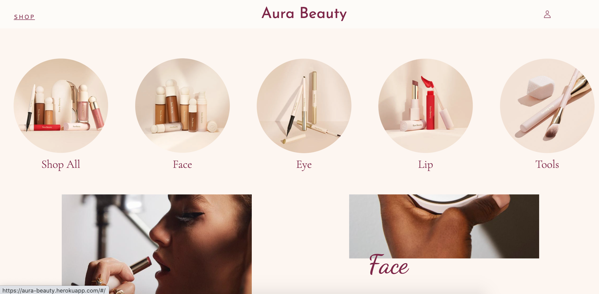

# Aura Beauty

Aura Beauty is a cosmetic webstore inspired by Rare Beauty, a beauty brand that focuses on embracing inner beauty as well as self-expression.

Live site: [Aura Beauty](https://aura-beauty.herokuapp.com/#/)

## Technologies Used

* Ruby on Rails
* Postgres SQL
* ActiveStorage
* React
* Redux
* AWS S3

## Functionality

### Splash Page
* Users are able to view featured items on the main page.
* Displays a navbar that displays a dropdown of all the categories of products.

### Sign In/ Sign Up
* Users are able to sign in to an existing account, or create a new account.

### Product Index
* Displays all the products available for purchase.
* Users are also able to view products filtered by category.
* Users are able to click on shades and see the shade name and product image change in real time.
 

### Single Product Page
* Displays the product information.
* Users can click on "MORE" to view a modal for a full ingredients list and the usage instructions.

### Future Features
* Shopping Cart
* Reviews
* Search Bar
* Loading Icon