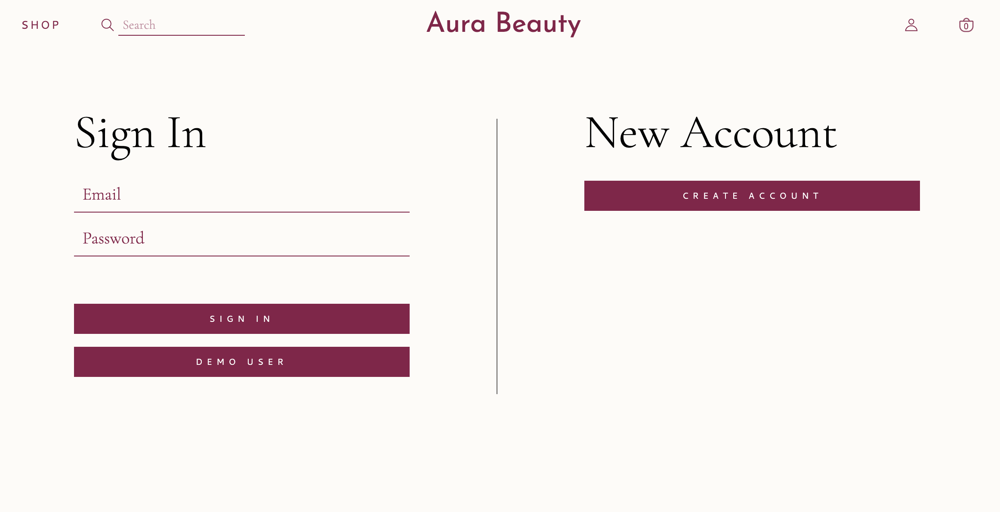

# Aura Beauty

    

Aura Beauty is a cosmetic web store inspired by Rare Beauty, a brand dedicated to reducing mental health stigma.

Live site: [Aura Beauty](https://aura-beauty.herokuapp.com/#/)

** Note: Aura Beauty is not mobile friendly yet! **

## Technologies Used

* Ruby on Rails
* Postgres SQL
* Javascript
* React
* Redux
* AWS S3
* LocalStorage

## Functionality

### Splash Page
* Users are able to view featured items on the main page.

* Displays a navbar that has a dropdown for all the categories of products.

### Sign In/ Sign Up
* Users are able to sign in to an existing account, or create a new account.

### Product Index
* Displays all the products available for purchase.
* Users are also able to view products filtered by category.
* Users are able to click on shades and see the shade name and product image change in real time.

When a shade is clicked, I set my state with that shade as the selected shade. If the shade I am on matches the selected shade in my state, I add a class of "selected" to that shade image. The shade with that class will have a maroon border around it, indicating what shade the user is currently on.

<pre><code>
    {this.props.productShades.map((shade) => {
        let selected = ""
        if (shade.name === this.state.selectedShadeName) {
            selected = "selected"
        }
        return (
            image className={selected} onClick={() => this.handleShadeClick(shade)}
        )
    })}
</code></pre>

An issue I faced was displaying a different image for products that had shades vs. products that did not have shades. My solution was to add logic in the componentDidMount lifecycle method. If the component is receiving shades, I set the photo to the product photo of the first shade. If the component does not receive any shades, I set the photo to the first product photo.

<pre><code>
    componentDidMount() {
        if (!this.props.productShades.length) {
            this.setState({photoUrl: this.props.product.photoUrls[0]})
        } else {
            this.setState({ photoUrl: this.props.productShades[0].productPhoto})
        }
    }
</code></pre>

### Single Product Page
* Displays the product information.
* Users can click on "MORE" to view a modal for a full ingredients list and the usage instructions.

### Shopping Cart
* Users can add, update, and delete cart items when they are not logged into an account.

    I implemented this by storing the cart items in localStorage when users are not logged in. 
<pre><code>
    let currentProduct = this.props.product
    const cartItems = JSON.parse(localStorage.getItem('cartItems')) || []

    let newItem = {
        product: this.props.product,
        quantity: 1
    }

    if (this.state.selectedShade) { //if this product has a shade, add the shade into the newItem as well
        newItem.shade = this.state.selectedShade
    }

    cartItems.push(newItem)
    localStorage.setItem('cartItems', JSON.stringify(cartItems))
</code></pre>

* When users log in after already adding items to their cart, those items are transferred to their account's cart.

<pre><code>
    const localCartItems = JSON.parse(localStorage.getItem('cartItems')) || []
    const userCartItems = Object.values(this.props.userCartItems)
    if (localCartItems.length) { // if we have items in local storage
        localCartItems.forEach((item) => {              
            let newItem = {
                cart_id: this.props.currentCart.id,
                product_id: item.product.id,
                quantity: item.quantity
            }

            if (item.shade) {
                newItem.shade_id = item.shade.id
            }

            this.props.createCartItem(newItem)
        })

        localStorage.clear()
    }
</code></pre>

### Search Bar
* Users can search for products and if there is no match, they can go back to browsing the site.

### Loading Icon
* I also implemented a loading icon for a nicer user experience.

