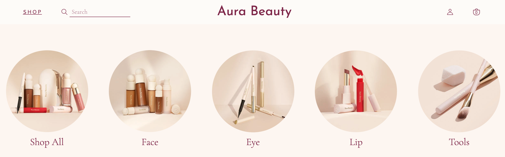

# Aura Beauty

Aura Beauty is a cosmetic webstore inspired by Rare Beauty, a beauty brand that focuses on embracing inner beauty as well as self-expression.

Live site: [Aura Beauty](https://aura-beauty.herokuapp.com/#/)

## Technologies Used

* Ruby on Rails
* Postgres SQL
* ActiveStorage
* React
* Redux
* AWS S3

## Functionality

### Splash Page
* Users are able to view featured items on the main page.
* Displays a navbar that displays a dropdown of all the categories of products.

### Sign In/ Sign Up
* Users are able to sign in to an existing account, or create a new account.

### Product Index
* Displays all the products available for purchase.
* Users are also able to view products filtered by category.
* Users are able to click on shades and see the shade name and product image change in real time.

When a shade is clicked, I set my state with that shade as the selected shade. If the shade I am on matches the selected shade in my state, I add a class of "selected" on that shade. The shade with that class will have a maroon border around it, indicating what shade the user is currently on.

<pre><code>
    {this.props.productShades.map((shade) => {
        let selected = ""
        if (shade.name === this.state.selectedShadeName) {
            selected = "selected"
        }
        return (
            image className={selected} onClick={() => this.handleShadeClick(shade)}
        )
    })}
</code></pre>

An issue I faced was displaying a different image for products that had shades vs. products that did not have shades. My solution was to add logic in my componentDidMount. If we are receiving shades, we set the photo to the product photo of the first shade. If we are not receiving shades, we set the photo to the first product photo.

<pre><code>
    componentDidMount() {
        if (!this.props.productShades.length) {
            this.setState({photoUrl: this.props.product.photoUrls[0]})
        } else {
            this.setState({ photoUrl: this.props.productShades[0].productPhoto})
        }
    }
</code></pre>

### Single Product Page
* Displays the product information.
* Users can click on "MORE" to view a modal for a full ingredients list and the usage instructions.

### Future Features
* Shopping Cart
* Reviews
* Search Bar
* Loading Icon